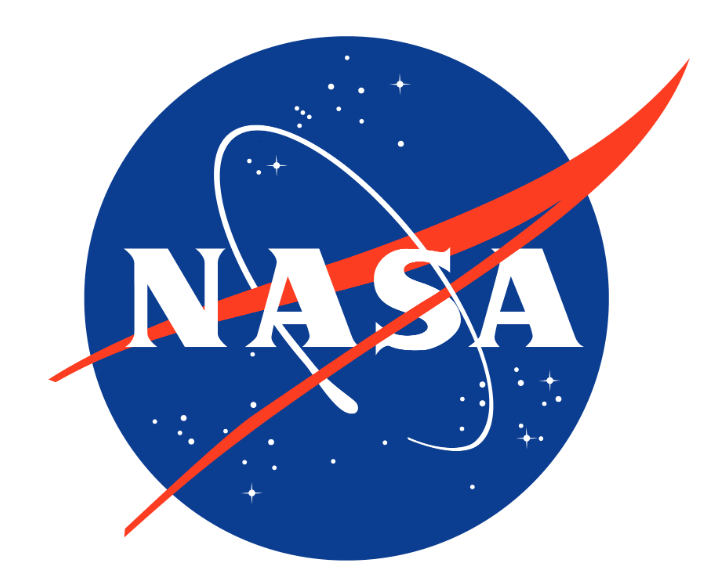
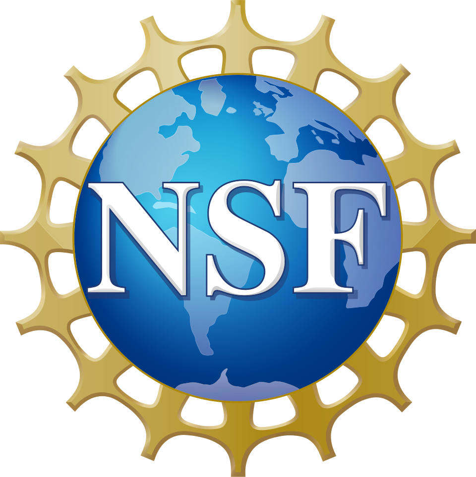

<h1 align="center">Hi 👋, I'm Jagrati Talreja</h1>
<h2 align="center">PhD and AI/ML Engineer</h2> 

<h3 align="center">Expert in Remote Sensing Satellite Image & Video Processing: Advancing Super-Resolution, Segmentation, Classification, SAR-to-optical Translation & Regression with Mathematical Precision</h2>

🌟 Welcome to My GitHub!

👨‍💻 About Me: I'm a passionate Artificial Intelligence Engineer and a highly motivated individual aiming to achieve high career growth through continuous learning and utilizing my skills to progress professionally and personally. 
I am a **Postdoctoral Fellow, Co-Lead & Co-PI on NASA & NSF funded projects** at North Carolina A&T State University, working at the intersection of:

🌌 <b>Remote Sensing & Earth Observation</b>

🤖 <b>Artificial Intelligence & Deep Learning</b>

⚛️ <b>Quantum-Inspired Machine Learning</b>

🛰️ <b>Multi-Modal Satellite Data Fusion</b>

I design <b>scalable AI pipelines for satellite imagery</b>, focusing on:

<ul>
<li>Flood monitoring & disaster assessment</li>
<li>SAR–Optical image translation</li>
<li>Super-resolution for Sentinel imagery</li>
<li>Multimodal learning (Sentinel-1 + Sentinel-2 + UAV)</li>
<li>Quantum-inspired machine learning for geospatial data encoding and analysis</li>
</ul>

💡 My work bridges **theory → real-world deployment**, combining physics-aware modeling, deep learning, and emerging quantum paradigms. 

---

💡 Expertise: 

🤖 Machine Learning & Deep Learning: Leveraging the power of AI to solve complex problems and drive progress. 

👁️ Computer Vision: Transforming the way we interact with the digital world through advanced image and video analysis. 

🛰️ Remote Sensing & Geospatial AI: Building AI-driven pipelines for satellite imagery (Sentinel-1 SAR, Sentinel-2 Optical, UAV), focusing on flood mapping, environmental monitoring, multimodal data fusion, and SAR–optical translation.

⚛️ Quantum-Inspired Machine Learning: Exploring hybrid classical-quantum approaches for efficient representation and learning from high-dimensional geospatial data.

🌐 Web Development: Building sleek, user-friendly, and efficient web applications tailored to meet diverse needs. 

📱 Android App Development: Creating engaging and intuitive mobile experiences that connect and inspire. 

🚀 My Mission: As a tech enthusiast, my goal is to develop cutting-edge solutions that make a real-world impact. I'm always ready to explore new horizons and push the boundaries of what's possible. 

## 🔬 Research Highlights

- 🛰️ **NASA & NSF Funded Research Leadership**
  - Co-leading AI-driven geospatial analytics projects
  - Developing scalable pipelines for environmental monitoring
  - I am also the first to initiate research on quantum-inspired machine learning frameworks within the College of Science and Technology at North Carolina A&T State University.

- 🧠 **Advanced AI Architectures**
  - CNNs, GANs, Transformers, Diffusion Models
  - Physics-guided and multimodal learning frameworks

- ⚛️ **Quantum Machine Learning**
  - Spatially-aware quantum encoding for satellite data
  - Hybrid classical-quantum pipelines for remote sensing

- 🌊 **Flood Intelligence Systems**
  - SAR + Optical fusion for flood mapping
  - Disaster damage assessment using deep learning

---

## 📚 Publications & Contributions

- 📄 IEEE Access, Springer, Elsevier, Wiley publications
- 📄 IGARSS 2026 (Accepted)
- 📄 IEEE Radar Conference 2026 (Accepted)
- 📄 ISPRS (Accepted)
- 📄 Multiple high-impact papers under review (Quantum ML + Remote Sensing)

## 🛠️ Technical Expertise

### 🤖 AI & Machine Learning
- Deep Learning (PyTorch, TensorFlow)
- Computer Vision & Image Processing
- Generative Models (GANs, Diffusion)
- Transformer Architectures
- Explainable AI (XAI)

### 🛰️ Remote Sensing & Geospatial
- Sentinel-1 SAR & Sentinel-2 Optical
- Google Earth Engine, SNAP, ArcGIS Pro
- Multimodal Data Fusion
- Flood Mapping & Environmental Monitoring

### ⚛️ Quantum & Advanced Systems
- Quantum-inspired ML pipelines
- Feature encoding for quantum circuits
- Hybrid classical-quantum modeling

### ⚙️ Systems & Tools
- CUDA, CuDNN, GPU Clusters (A100/H100)
- Docker, Linux, VS Code
- FPGA & Edge AI systems

## 🏆 Achievements

- 🥇 Gold Medalist (B.Tech)
- 🎓 Fully funded PhD (C2F Scholarship)
- 🛰️ NASA & NSF Project Leadership

🤝 Let's Connect: Whether you're looking for a collaborator on an exciting project or just want to chat about the latest in tech, feel free to reach out. Let's innovate and grow together!</h3>

  

<h3 align="left">Connect with me:</h3>

## 🛠️ Languages and Tools

                           

---

## 📊 GitHub Stats

<table>
<tr>
<td width="60%">

</td>
<td width="40%">

</td>
</tr>
</table>

---

## 🔥 GitHub Activity & Contributions

 

<table>
<tr>
<td width="40%">

</td>
<td width="60%">

</td>
</tr>
</table>

---
